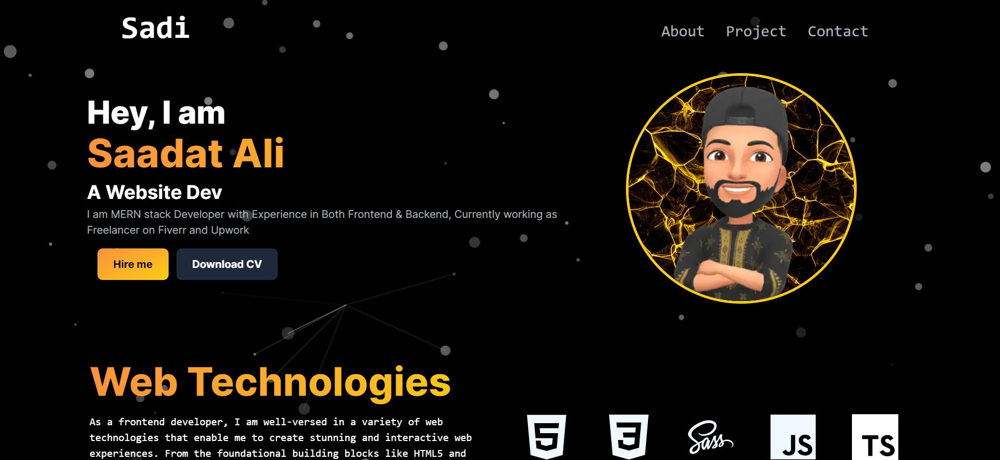

# Saadat Ali Portfolio

This repository contains the code for my personal portfolio website built with Next.js and React.

## Live Demo
Access the live version of the project: [Netlify Link](https://saadataliportfolio.netlify.app/)

This project is also deployed and hosted on Netlify. Click the link above to explore the live version.

## Description

My portfolio website serves as a showcase of my projects, skills, and experiences. It is designed to provide an overview of my work and allow visitors to learn more about me and my expertise.

## Technologies Used

- **Next.js** - Version 14.0.3
- **React** - Version 18
- **@emailjs/browser** - Version 3.11.0
- **@heroicons/react** - Version 2.0.18
- **emailjs-com** - Version 3.2.0
- **framer-motion** - Version 10.16.4
- **react-animated-numbers** - Version 0.17.1
- **react-dom** - Version 18
- **react-intersection-observer** - Version 9.5.3
- **react-particles** - Version 2.12.2
- **react-scroll** - Version 1.9.0
- **react-toastify** - Version 9.1.3
- **react-type-animation** - Version 3.2.0
- **resend** - Version 2.0.0
- **toastify** - Version 2.0.1
- **tsparticles** - Version 2.12.0

### Development Dependencies

- **autoprefixer** - Version 10
- **cssnano** - Version 6.0.1
- **postcss** - Version 8
- **tailwindcss** - Version 3

## Features

- Interactive design using **Framer Motion** for smooth animations.
- Utilizes **React Intersection Observer** for handling scroll-based animations.
- **React Particles** library used for creating engaging particle effects.
- Incorporates **React Scroll** for smooth scrolling navigation.
- Enhanced user experience with **React Toastify** for toast notifications.

## Usage

To run this project locally:

1. Clone this repository.
2. Install dependencies using `npm install`.
3. Run the development server with `npm run dev`.
4. Open [http://localhost:3000](http://localhost:3000) to view it in the browser.

## Screenshots

_Insert screenshots or GIFs showcasing your website here._

## License

This project is licensed under the MIT License - see the [LICENSE](link_to_license_file) file for details.
